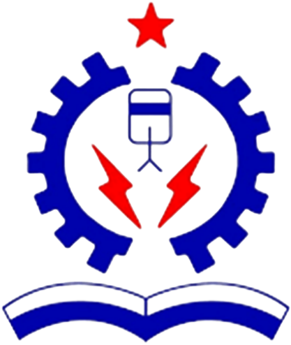
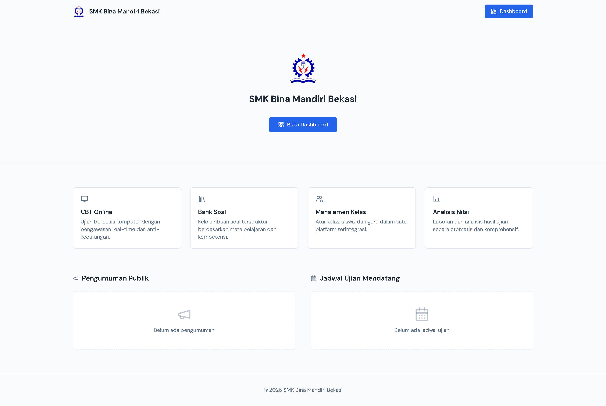

<p align="center">
  
</p>

<h1 align="center">SMK LMS + CBT</h1>

<p align="center">
  Sistem ujian dan pembelajaran digital terintegrasi untuk Sekolah Menengah Kejuruan.<br>
  Dioptimasi untuk 500+ siswa ujian bersamaan pada infrastruktur server sekolah standar.
</p>

<p align="center">
  <a href="LICENSE"></a>
  
  
  
  
  
  
  
  
</p>

### Landing Page

<p align="center">
  
</p>


## Daftar Isi

- [Tentang Proyek](#tentang-proyek)
- [Fitur](#fitur)
- [Tech Stack](#tech-stack)
- [Arsitektur](#arsitektur)
- [Instalasi](#instalasi)
- [Akun Default](#akun-default)
- [Konfigurasi](#konfigurasi)
- [Deployment Produksi](#deployment-produksi)
- [Testing](#testing)
- [Struktur Proyek](#struktur-proyek)
- [Lisensi](#lisensi)

## Tentang Proyek

SMK LMS menggabungkan Learning Management System dan Computer Based Test dalam satu aplikasi monolith. Dibangun untuk kebutuhan spesifik sekolah menengah kejuruan yang ingin menyelenggarakan ujian digital tanpa bergantung pada layanan cloud, cukup dengan server lokal sekolah.

Proyek ini dimulai dari Laravel Vue starter kit (`laravel new --using vue`) dan dikembangkan dengan fokus pada reliabilitas ujian — auto-save jawaban, crash recovery, dan timer yang disinkronkan dengan server. Redis digunakan sebagai buffer wajib karena sebagian besar server sekolah masih menggunakan HDD, bukan SSD.

## Fitur

### Computer Based Test

Mendukung tujuh tipe soal: pilihan ganda, benar/salah, esai, isian singkat, menjodohkan, pilihan ganda kompleks, dan mengurutkan. Soal objektif dinilai otomatis, esai melalui interface koreksi manual.

Jawaban siswa tersimpan otomatis setiap 30 detik ke browser (localStorage) dan server (Redis). Jika browser crash atau mati lampu, siswa login ulang dan langsung melanjutkan — jawaban dan timer tetap utuh. Timer ujian disinkronkan dengan server untuk mencegah manipulasi waktu.

Dashboard proktor menampilkan status seluruh peserta secara real-time via WebSocket: progress pengerjaan, pelanggaran anti-cheat (pindah tab, keluar fullscreen), dan aksi manual seperti perpanjangan waktu atau terminasi ujian.

Fitur keamanan meliputi token akses per sesi, randomisasi urutan soal dan jawaban, device/IP locking, serta fullscreen enforcement dengan logging pelanggaran.

### Learning Management System

Guru dapat mengunggah materi pembelajaran (PDF, DOCX, PPTX, link YouTube), membuat tugas dengan deadline, dan memantau progres belajar siswa. Tersedia forum diskusi per mata pelajaran, sistem pengumuman, dan presensi digital.

### Manajemen Sekolah

Admin mengelola pengguna (tiga peran: Admin, Guru, Siswa) dengan dukungan import massal via Excel/CSV. Struktur akademik mencakup tahun ajaran, jurusan, kelas, dan mata pelajaran. Tersedia analisis butir soal, rekap hasil ujian, serta ekspor ke Excel dan PDF.

## Tech Stack

| Layer | Teknologi | Versi |
|-------|-----------|-------|
| Backend | Laravel | 12.x |
| Frontend | Vue 3 + Inertia.js + TypeScript | Vue 3.5+, Inertia 2.x |
| UI Components | shadcn-vue + TanStack Table | Latest |
| Styling | Tailwind CSS | 4.x |
| Database | MySQL | 8.x |
| Cache & Queue | Redis | 7.x |
| WebSocket | Laravel Reverb | 1.x |
| Rich Text Editor | Tiptap | Latest |
| Testing | Pest PHP | Latest |

## Arsitektur

Auto-save jawaban ujian mengalir dari browser ke database melalui Redis sebagai buffer:

```
Browser (localStorage)
  ↓  setiap 30 detik
Laravel API → Redis buffer
                ↓  queue job periodik
              MySQL (persist)
```

Saat submit ujian, jawaban langsung ditulis ke MySQL dan Redis key dihapus. Saat crash recovery, jawaban di-restore dari Redis (atau localStorage jika lebih baru).

Redis wajib digunakan karena server sekolah umumnya menggunakan HDD dengan latency 50-100x lebih lambat dari SSD. Seluruh session, cache, queue, dan buffer jawaban ujian disimpan di Redis.

## Instalasi

### Prasyarat

- PHP >= 8.2 beserta ekstensi Laravel 12
- Composer 2.x
- Node.js >= 20
- MySQL 8.x
- Redis 7.x (wajib)

### Setup

```bash
# 1. Clone repository
git clone https://github.com/zhfrn-zzz/CBT_SMK.git smk-lms
cd smk-lms

# 2. Install dependensi
composer install
npm install

# 3. Konfigurasi environment
cp .env.example .env
php artisan key:generate
```

Sesuaikan `.env` dengan koneksi database dan Redis:

```dotenv
DB_CONNECTION=mysql
DB_HOST=127.0.0.1
DB_PORT=3306
DB_DATABASE=smk_lms
DB_USERNAME=root
DB_PASSWORD=

REDIS_HOST=127.0.0.1
REDIS_PORT=6379

SESSION_DRIVER=redis
CACHE_STORE=redis
QUEUE_CONNECTION=redis
```

```bash
# 4. Migrasi database dan seed data
php artisan migrate --seed
php artisan storage:link
npm run build
```

### Menjalankan Development Server

```bash
php artisan serve          # Laravel (terminal 1)
npm run dev                # Vite (terminal 2)
php artisan queue:work redis   # Queue worker (terminal 3)
php artisan reverb:start       # WebSocket (terminal 4)
```

## Akun Default

Setelah menjalankan seeder:

| Peran | Username | Email | Password |
|-------|----------|-------|----------|
| Admin | admin | admin@smklms.test | password |
| Guru | guru | guru@smklms.test | password |
| Siswa | 100 akun otomatis | — | password |

Seeder membuat 5 guru tambahan (dengan NIP dan mata pelajaran) dan 100 siswa yang terdistribusi ke beberapa kelas.

## Konfigurasi

| Variable | Nilai | Keterangan |
|----------|-------|------------|
| `APP_TIMEZONE` | `Asia/Jakarta` | Zona waktu (WIB) |
| `SESSION_DRIVER` | `redis` | Wajib Redis |
| `CACHE_STORE` | `redis` | Wajib Redis |
| `QUEUE_CONNECTION` | `redis` | Wajib Redis |
| `BCRYPT_ROUNDS` | `12` | Rounds hashing password |
| `EXAM_SECURITY_HARDENING` | `true` | Fitur keamanan ujian |

Konfigurasi identitas sekolah, tahun ajaran aktif, dan pengaturan lainnya dilakukan melalui panel Admin setelah login.

## Deployment Produksi

Minimum server: prosesor multi-core, RAM 16GB, Redis wajib. SSD disarankan, tapi sistem dioptimasi untuk HDD.

Komponen yang perlu disiapkan:

1. **Nginx** dengan PHP-FPM — contoh konfigurasi tersedia di `docs/server-configs/`
2. **Supervisor** untuk queue worker:
   ```ini
   [program:smk-lms-worker]
   command=php /path/to/artisan queue:work redis --sleep=3 --tries=3 --max-time=3600
   numprocs=2
   autostart=true
   autorestart=true
   ```
3. **Redis** sebagai service yang berjalan saat boot
4. **SSL/TLS** via Let's Encrypt atau sertifikat lainnya
5. Build dan optimize:
   ```bash
   npm run build
   php artisan optimize
   ```

Pastikan `APP_ENV=production`, `APP_DEBUG=false`, dan `APP_URL` sesuai domain.

## Testing

```bash
php artisan test                    # semua test
php artisan test --filter=NamaTest  # test spesifik
php artisan test --compact          # output ringkas
```

## Struktur Proyek

```
app/
├── Enums/                          # PHP Enums (UserRole, QuestionType, ExamStatus)
├── Http/
│   ├── Controllers/
│   │   ├── Admin/                  # Controller admin
│   │   ├── Guru/                   # Controller guru
│   │   └── Siswa/                  # Controller siswa
│   └── Requests/                   # Form Request validation
├── Models/                         # Eloquent models
├── Services/                       # Business logic
├── Jobs/                           # Queue jobs (grading, import, export)
├── Policies/                       # Authorization
└── Events/                         # Broadcasting (proktor)

resources/js/
├── components/ui/                  # shadcn-vue components
├── Components/                     # Custom (Exam/, DataTable/)
├── Pages/{Admin,Guru,Siswa}/       # Inertia pages per role
├── composables/                    # useExamTimer, useAutoSave, dll
└── types/                          # TypeScript interfaces

routes/web.php                      # Semua route Inertia
docs/server-configs/                # Konfigurasi Nginx, Redis, MySQL
```

## Kontribusi


## Lisensi

Copyright (c) 2026 SMK Bina Mandiri Bekasi. All Rights Reserved.

Lihat file [LICENSE](LICENSE) untuk detail.
